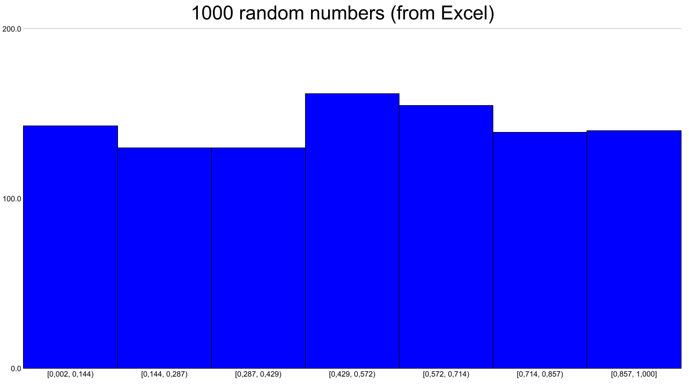

# Programming Fundamentals course. Mathematics and Computer Science Faculty at SPbU

## Project #3. Data visualization

[Task (in Russian)](./TASK.md)

## Usage
`distribution/bin/pf-2021-viz -d <PATH TO INPUT CSV> -t <bar|histogram|pie|scatter> [OPTIONS]` (run from root directory)

Viz tools renders different types of charts into SVG (also PNG by request), using data from external CSV file.
CSV files should conform to format described below.

The delimiter in CSV files should be `;` (semicolon). Any CSV files that are provided as input should have
all cells filled (or marked as empty with semicolon following previous semicolon).

To use `;` (semicolon) as a part of data cells, wrap your string with semicolon in double quotes. Example: `...;"data;with;semicolons";...`.
`cars.csv` was updated to reflect this ("Mercedes-Benz" and "Rolls-Royce" are now "Mercedes;Benz" and "Rolls;Royce").

I use term "Series" for rows of provided CSV and term "Input" for columns of provided CSV, meaning that data in same
column is always from one input and vice versa; similar for rows.

## Options description

Option|Description
------|-----------
`-o`, `--output` `<OUT_FILE>`               |The name of the output file
`-d`, `--data` `<CSV_IN_FILE>`                 |(required) The name of the data file (in CSV format)
`-s`, `--size` `<WIDTH> <HEIGHT>`              |Dimensions of the output PNG file: first width, then height in pixels
`-p`, `--PNG`                       |Render PNG alongside with SVG
`-r`, `--rows-labels`               |Treat first column as labels for rows in CSV
`-c`, `--columns-labels`            |Treat first row as labels for columns in CSV
`-t`, `--type` `<bar/histogram/pie/scatter>`  |(required) The type of the chart. Can be only one of the following: "bar", "histogram", "pie", "scatter"
`--title` `<TITLE>`                    |Set the chart title
`-m`, `--minimize`                  |Don't show window with SVG
`--horizontal`                      |If bar is the selected chart type, make bars horizontal
`--stacked`                         |If bar is the selected chart type, make different inputs of data stack on top of each other
`-b`, `--bars`                      |If histogram is the selected chart type, this option sets the number of bars (10 is default)
`-h`, `--help`                      |Show this message and exit

## Bar chart
Useful for comparing multiple series of data from multiple inputs
(e.g. sales of different departments each year).

Orientation of chart and display style of multiple inputs can be customized.

*Stacked horizontal bar chart with a lot of data*

*Bar chart with auto-generated columns labels (`Input N`)*

## Histogram chart
Useful for observing distributions.

The data for histogram is taken only from the first column; columns and row labels are ignored. Number of bars
can be customized.

*Distribution of 1000 random numbers, generated in Excel*

## Pie chart
Useful for comparing each party's share.

The data from pie chart is taken only from first row.

## Scatter chart
Useful for rendering arbitrary functions graph.

Only first two columns are taken; the first column represents the x coordinates of points, 
the second column represents y coordinates.

*Hyperbola graph*

## Testing
Examples of CSV files and output SVGs can be found in `test_csvs`. All figures in this README.md are PNG produced 
using these CSVs (see `figures` directory). Run `./test.sh` to automatically generate those CSVs.
